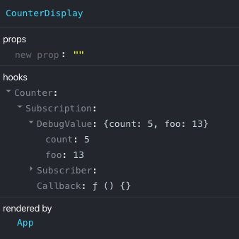

<p align="right">
  <strong>
    <a href="README.md">English</a>
  </strong>
  <br/>
  <sup><em>(Please contribute translations!)</em></sup>
</p>

# Use Global State Hook

> Super tiny state sharing library with hooks

## Install

```sh
npm install --save global-state-hook
```

## Example

[](https://codesandbox.io/s/bold-ellis-6rg1t?fontsize=14&hidenavigation=1&theme=dark)

```jsx harmony
import React from "react"
import { createSubscription, useSubscription } from "global-state-hook"
import { render } from "react-dom"

const counterSubscription = createSubscription({ count: 0, foo: 10 })

function CounterDisplay() {
  let { state, setState } = useSubscription(counterSubscription)
  return (
    <div>
      <button onClick={() => setState({ count: state.count - 1 })}>-</button>
      <span>{state.count}</span>
      <button onClick={() => setState({ count: state.count + 1 })}>+</button>
    </div>
  )
}
function FooDisplay() {
  // Only update when foo change
  let { state, setState } = useSubscription(counterSubscription, ["foo"])
  return (
    <div>
      <button onClick={() => setState({ foo: state.foo - 1 })}>-</button>
      <span>{state.foo}</span>
      <button onClick={() => setState({ foo: state.foo + 1 })}>+</button>
    </div>
  )
}

function App() {
  return (
    <>
      <CounterDisplay />
      <FooDisplay />
    </>
  )
}

render(<App />, document.getElementById("root"))
```

## API

### `createSubscription(initialState)`

```js
import { createSubscription } from "global-state-hook"

const counterSubscription = createSubscription({ count: 0 })
```

### `useSubscription(subscriber)`

```js
import { createSubscription, useSubscription } from "global-state-hook"

const counterSubscription = createSubscription({ count: 0 })

// Your custom hook goes here so you can share it to anywhere
const useCounter = () => {
  let { state, setState } = useSubscription(counterSubscription)
  const increment = () => setState({ count: state.count + 1 })
  const decrement = () => setState({ count: state.count + 1 })
  return { count: state.count, increment, decrement }
}

function Counter() {
  let { count, increment, decrement } = useCounter()
  return (
    <div>
      <button onClick={decrement}>-</button>
      <span>{count}</span>
      <button onClick={increment}>+</button>
    </div>
  )
}
```

### `useSubscription(subscriber, pick: string[])`

```js
import { createSubscription, useSubscription } from "global-state-hook"

const counterSubscription = createSubscription({ count: 0, foo: 10 })

function Foo() {
  // Only update when foo change
  let { state, setState } = useSubscription(counterSubscription, ["foo"])

  return (
    <div>
      <button onClick={() => setState({ foo: state.foo - 1 })}>-</button>
      <span>{state.foo}</span>
      <button onClick={() => setState({ foo: state.foo + 1 })}>+</button>
    </div>
  )
}
```

## Why use global-state-hook?

**It's minimal** You only need to learn 2 API: createSubscription, useSubscription.

**It's easy to integrate** Can integrate with any React library.

**It's small** Only 50 lines of code for this library.

## Guide

### Global state is not bad.

It's about how you manage it, global state will not be bad if you do it the right way.
You can consider using `Context.Provider` to provide your global subscription so it can be clean up after the component unmounted. Example:

```js
const TextContext = React.createContext < any > null

const useTextValue = () => {
  const textSubscription = useContext(TextContext)
  let { state, setState } = useSubscription(textSubscription)
  const onChange = (e) => setState({ value: e.target.value })
  return { value: state.value, onChange }
}

function Text() {
  let { value, onChange } = useTextValue()
  return (
    <div>
      <input value={value} onChange={onChange} />
    </div>
  )
}

function TextComponent() {
  const textSubscription = createSubscription({
    value: "The text will sync together",
  })
  return (
    <TextContext.Provider value={textSubscription}>
      <Text />
    </TextContext.Provider>
  )
}
```

### Tip#1: Select your state property that you want to subscribe to

By default some people might recommend you to put only one state to a `subscription`, for example:

```js
const textSubscription = createSubscription("Your initial state here")

let { state: text, setState: setText } = useSubscription(textSubscription)

// Change the text value:
setText("New text value")
```

But in case you have a very large Component with many state in it, so what is the proper way to handle? Just see my code below:

```js
import { createSubscription, useSubscription } from "global-state-hook"

const multiStateSubscription = createSubscription({ foo: 1, bar: 2, baz: 3 })

function Foo() {
  // Only update when foo or baz change
  let { state, setState } = useSubscription(multiStateSubscription, [
    "foo",
    "baz",
  ])

  return (
    <div>
      <button onClick={() => setState({ foo: state.foo - 1 })}>-</button>
      <span>{state.foo}</span>
      <span>{state.baz}</span>
      <button onClick={() => setState({ foo: state.foo + 1 })}>+</button>
    </div>
  )
}
```

### Reducer pattern:

For those who still in love with redux, the reducer pattern will fit for you:

```js
const counterSubscription = createSubscription({ count: 0 })
function reducer(state, action) {
  switch (action.type) {
    case "increment":
      return { count: state.count + 1 }
    case "decrement":
      return { count: state.count - 1 }
    default:
      throw new Error()
  }
}

function Counter() {
  const { state, dispatch } = useReducerSubscription(
    counterSubscription,
    reducer,
  )
  return (
    <>
      Count: {state.count}
      <button onClick={() => dispatch({ type: "decrement" })}>-</button>
      <button onClick={() => dispatch({ type: "increment" })}>+</button>
    </>
  )
}
```

### Misc

# Support debugging with React Developer Tools



It's so easy right? :D
